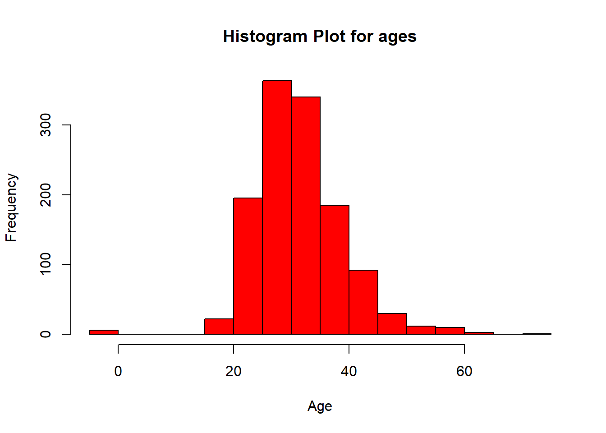
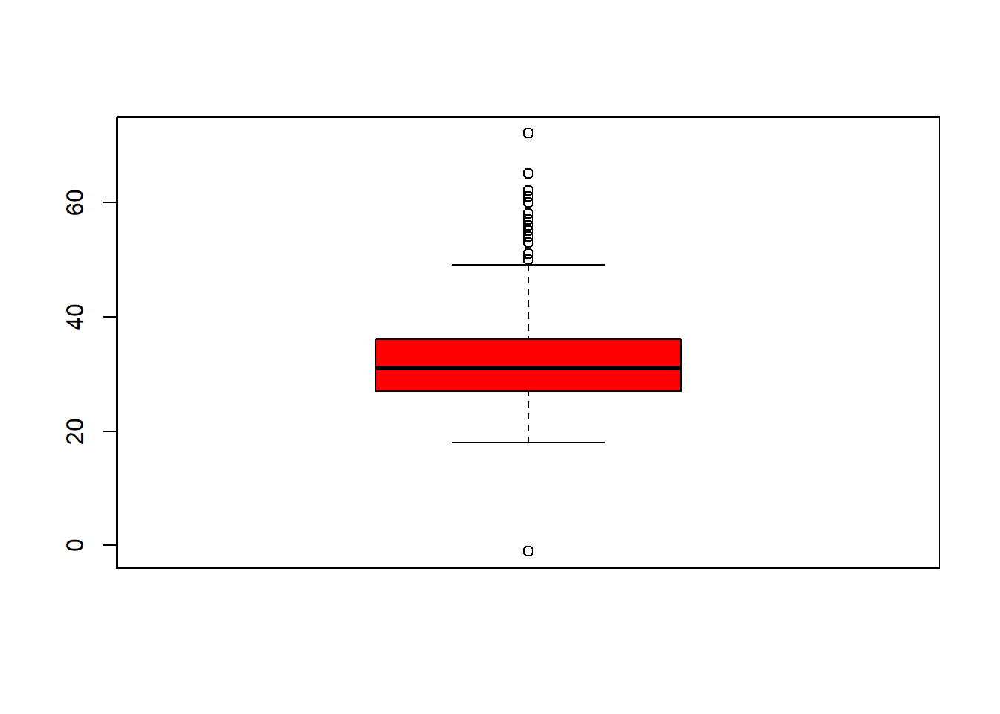
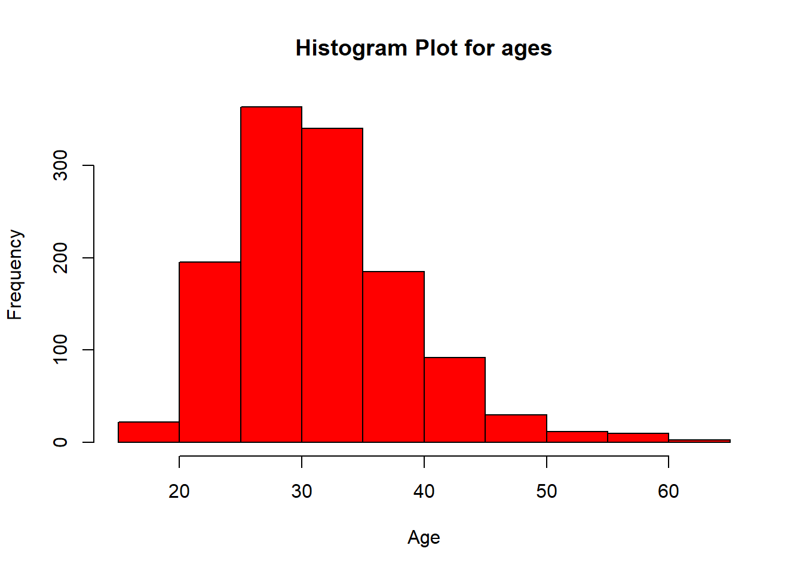
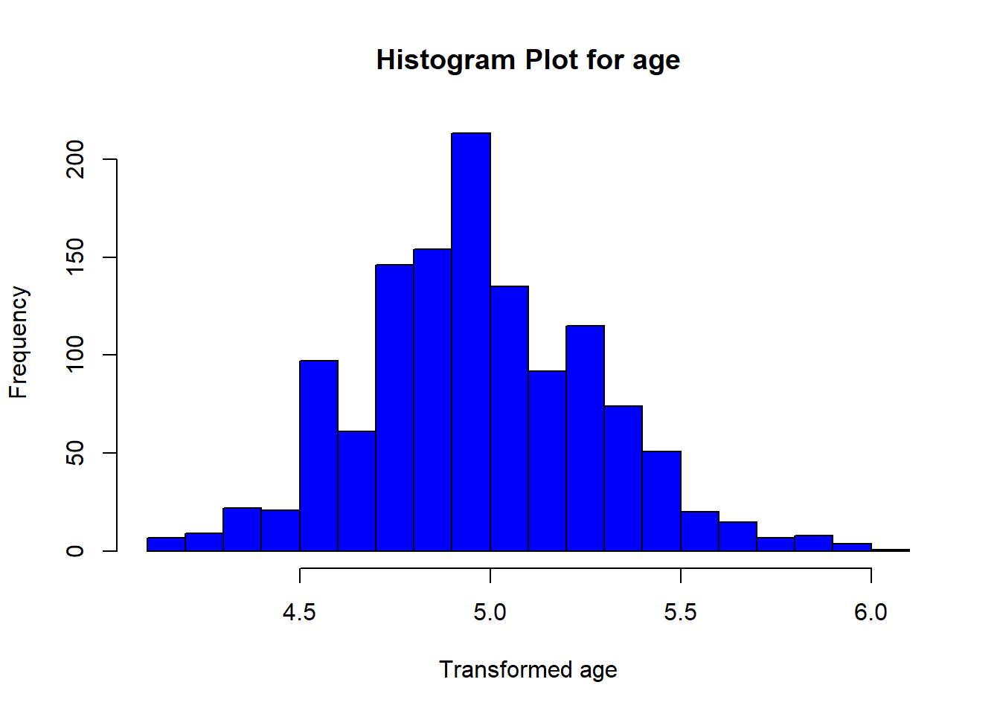
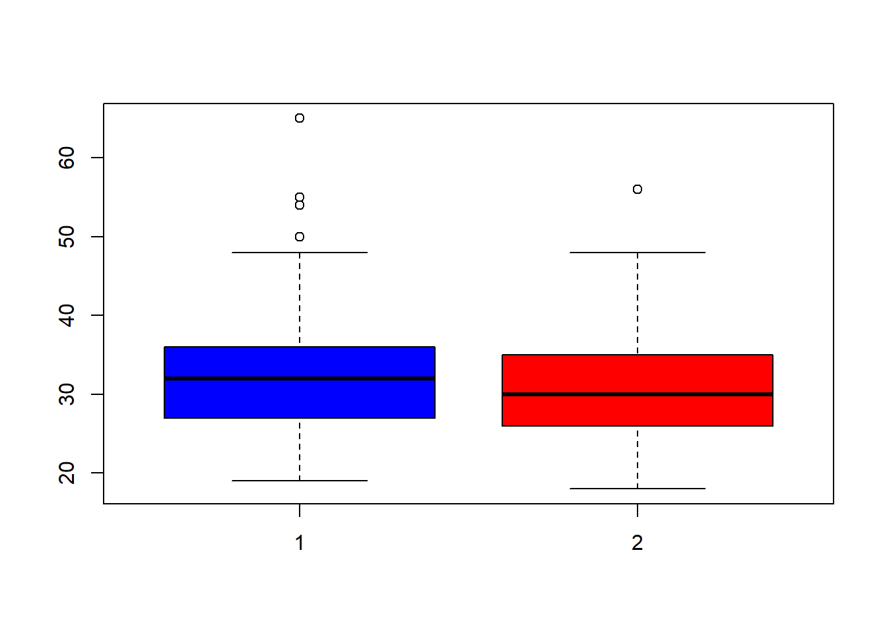
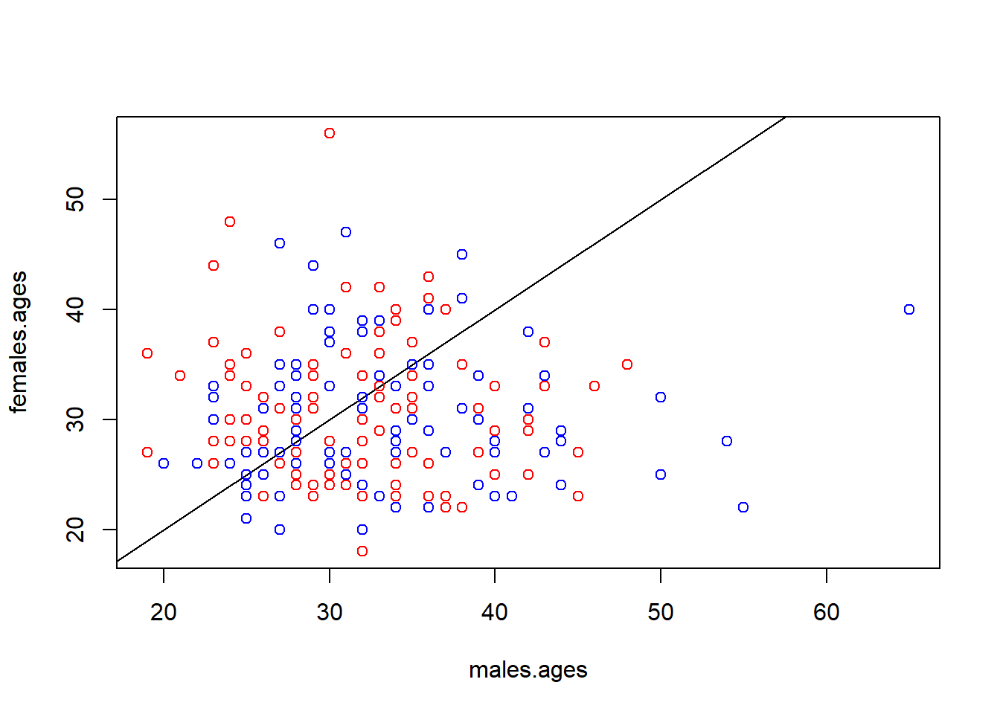
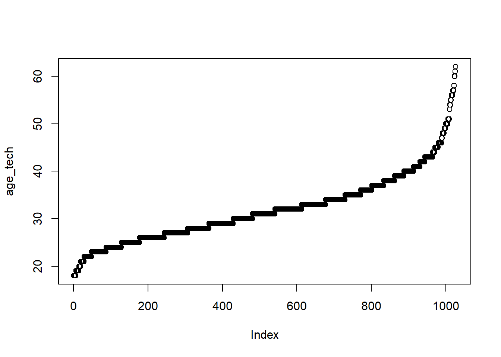

```r
#Importing the dataset after cleaning
library(readr)
dataset.mh <- read_csv("new_survey_dataset.csv")
```

```
## Rows: 1259 Columns: 27
## ── Column specification ────────────────────────────────────────────────────────
## Delimiter: ","
## chr  (3): timestamp, country, US_state
## dbl (24): id, age, gender, self_employed, family_history, treatment_seek, wo...
## 
## ℹ Use `spec()` to retrieve the full column specification for this data.
## ℹ Specify the column types or set `show_col_types = FALSE` to quiet this message.
```
# Data Visualization

```r
#Visualizing the ages of the workers
hist(dataset.mh$age, col="red",xlab = "Age", main = "Histogram Plot for ages", breaks = 15)
```



```r
boxplot(dataset.mh$age, col="red")
```




```r
#Getting rid of the outliers
newDF<-subset(dataset.mh, 10 < age & age < 70)
hist(newDF$age, col="red",xlab = "Age" ,main = "Histogram Plot for ages",breaks = 15)
```



```r
#Data transformating using log transformation
transformedDF<-transform(newDF, age.log=log2(age))
hist(transformedDF$age.log, col="blue",xlab = "Transformed age" ,main = "Histogram Plot for age",breaks = 15)
```



**We can assume that the data is not normally distributed**

# Confidence Interval for Mean

**A confidence interval is the mean of your estimate plus and minus the variation in that estimate.**


```r
#sd is known
norm.interval = function(data, variance, conf.level =0.95){
  z = qnorm((1 - conf.level)/2, lower.tail=FALSE)
  xbar = mean(data)
  sdx = sqrt(variance/length(data))
  c(xbar - z * sdx, xbar + z*sdx)
}

newDF.var <- var(newDF$age)
norm.interval(newDF$age, newDF.var)
```

```
## [1] 31.64363 32.44103
```


```r
#Standard deviation is unknown
newDF.CI <- t.test(newDF$age)$conf.int
newDF.CI
```

```
## [1] 31.64324 32.44142
## attr(,"conf.level")
## [1] 0.95
```


# Single t-test
**Our aim here is to check whether the mean of the workers age is equal or less than 30 years old with a confidence level of 95%**
**H1: mu=<30, H1: mu>30, Alpha=0.05**


```r
#Applying Single t-test
t.test(newDF$age, mu=30, alt = "greater", conf = 0.95)
```

```
## 
## 	One Sample t-test
## 
## data:  newDF$age
## t = 10.04, df = 1251, p-value < 2.2e-16
## alternative hypothesis: true mean is greater than 30
## 95 percent confidence interval:
##  31.70748      Inf
## sample estimates:
## mean of x 
##  32.04233
```
**Since the p-value is less than alpha, we reject the null hypothesis**

# Paired t-test
**Our aim is to compare the difference between the males and females**
**H1: mu=0, H1: mu!=0, Alpha=0.01**


```r
#Dividing the dataset to two groups
library("usethis")
library("devtools")
source_gist("https://gist.github.com/mrdwab/6424112")
```

```
## ℹ Sourcing https://gist.githubusercontent.com/mrdwab/6424112/raw/09eabaab7896db4834d9d49bec105ce680c01439/stratified.R
```

```
## ℹ SHA-1 hash of file is 8dbe107b0f29f34e58178a2b8eb60f169eabf817
```

```r
sampledData<-stratified(newDF, "gender",select = list(gender= c("1","2")), size=200)

males.ages<-sampledData$age[1:200]
females.ages<-sampledData$age[201:400]

boxplot(males.ages, females.ages, col=c("blue","red"))
```



```r
plot(males.ages, females.ages, col=c("blue", "red"), abline(a=0, b=1))
```



**We assume that the variables are metric and the difference of the paired values is normally distributed **


```r
t.test(males.ages, females.ages, mu=0, alt="two.sided", paired = T, conf = 0.99)
```

```
## 
## 	Paired t-test
## 
## data:  males.ages and females.ages
## t = 2.1666, df = 199, p-value = 0.03146
## alternative hypothesis: true mean difference is not equal to 0
## 99 percent confidence interval:
##  -0.292597  3.212597
## sample estimates:
## mean difference 
##            1.46
```
**Since the p-value is less than 0.05, we reject the null hypothesis**

# Z-Test

**A Z-test is a type of hypothesis test—a way for you to figure out if results from a test are valid or repeatable.**

# One Sample Z-test

- First visualize necessary column and convert to the normal distribution

```r
library(ggpubr)
```

```
## Zorunlu paket yükleniyor: ggplot2
```

```r
library(moments)

#visualizing ages 
age_df <- subset(newDF,subset = tech_company == 1, select =age )

age_tech <-  sort(age_df$age)
mean(age_tech)
```

```
## [1] 31.87817
```

```r
plot(age_tech)
```




```r
library(BSDA)
```

```
## Zorunlu paket yükleniyor: lattice
```

```
## 
## Attaching package: 'BSDA'
```

```
## The following object is masked from 'package:datasets':
## 
##     Orange
```

```r
z.test(age_tech, mu=mean(age_tech), sigma.x= sd(age_tech))
```

```
## 
## 	One-sample z-Test
## 
## data:  age_tech
## z = 0, p-value = 1
## alternative hypothesis: true mean is not equal to 31.87817
## 95 percent confidence interval:
##  31.44081 32.31552
## sample estimates:
## mean of x 
##  31.87817
```

- The test statistic for the one sample z-test is 0 and the corresponding p-value 1.

- Since p value is greater than .05, we have not sufficient evidence to reject the null hypothesis.


# 2 Sample Z-test


```r
#subsetted to then data fframes with respect to working with tech company or not
age_df_1 <- subset(newDF,subset = tech_company == 1, select =age )
age_df_0 <- subset(newDF,subset = tech_company == 0, select =age )

age_tech_1 <-  sort(age_df_1$age)
age_tech_0 <-  sort(age_df_0$age)
```


```r
z.test(x=age_tech_1, y=age_tech_0, mu=0, sigma.x=sd(age_tech_1), sigma.y=sd(age_tech_0))
```

```
## 
## 	Two-sample z-Test
## 
## data:  age_tech_1 and age_tech_0
## z = -1.6843, p-value = 0.09213
## alternative hypothesis: true difference in means is not equal to 0
## 95 percent confidence interval:
##  -1.967751  0.148865
## sample estimates:
## mean of x mean of y 
##  31.87817  32.78761
```
- The test statistic for the one sample z-test is -1.6843 and the corresponding p-value = 0.09213.

- Since p value is greater than .05, we have not sufficient evidence to reject the null hypothesis.
